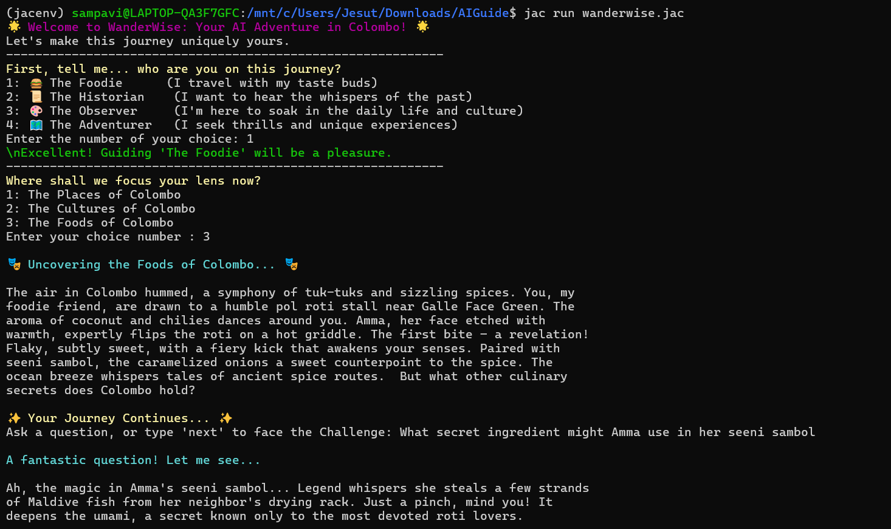
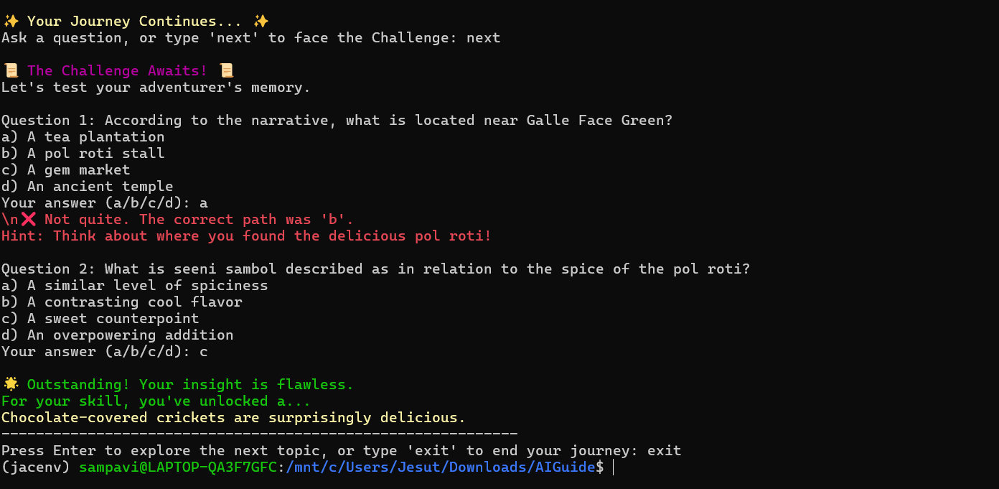

# ✨ WanderWise: AI-Powered Storytelling Journey through Colombo 

> _“Let stories guide your footsteps. Let wonder lead the way.”_

**WanderWise** is your immersive, AI-enhanced travel companion—turning your visit to **Colombo, Sri Lanka**, into a dynamic, story-rich adventure. From bustling markets to hidden beaches, WanderWise doesn’t just guide you—it **enchants you**.

---

### 👥 Team: NeuroNex

## ✨ Features At a Glance

| 🧠 Feature | 💬 Description |
|-----------|----------------|
| **🗺️ Immersive Narratives** | Choose a travel theme and enjoy vivid, sensory-rich stories. |
| **❓ Story-Driven Quizzes** | Answer questions based on each narrative to test memory and insight. |
| **🕵️ Unlock Hidden Gems** | Earn clues to offbeat spots through story interaction. |
| **💬 Conversational AI** | Ask anything—get lore-rich, imaginative responses powered by LLMs. |

---

## 🚀 Getting Started

### Prerequisites

- Python 3.12 or higher  
- [mtllm](https://pypi.org/project/mtllm/) library  
- A valid API key for your chosen LLM (e.g., Gemini)

### Installation

1. *Clone the repository*

   git clone <https://github.com/Sampavi15/AIGuide.git>
   cd AIGuide
   

2. *Install dependencies*
   
   pip install -r requirements.txt
   

3. *Set your API key*
   
   export GEMINI_API_KEY=your_api_key_here
   
   Or on Windows:
   
   set GEMINI_API_KEY=your_api_key_here
   
### Start Your Journey

python wanderwise.jac

Follow the prompts to select your persona, explore topics, ask questions, and unlock the magic of Colombo!

---

## 🗂 Project Structure

- wanderwise.jac — Main application logic (Jac code, LLM integration, user interaction)
- requirements.txt — Python dependencies
- screenshots/ — Example screenshots of the application

---

## 📸 Screenshots

The `screenshots/` folder contains **step-by-step visuals** of the WanderWise experience

---

## 📜 License

For educational and demonstration purposes only.

---

> *Let every story spark wonder,  
> every quiz unlock a secret,  
> and every journey with WanderWise become a cherished memory.*

